# Support-Led Ordering System Flowcharts

## 1. Main User Flow

```mermaid
flowchart TD
    A[👤 User Opens App] --> B[📱 Browse Menu / Add to Cart]
    B --> C{Friction Score > 60?}
    
    C -->|No| D[✅ User Completes Order]
    D --> E[🎉 Order Placed Successfully]
    
    C -->|Yes| F{Check Order Value}
    
    F -->|< ₹5,000| G[📚 Show FAQ / Self-Serve]
    G --> B
    
    F -->|₹5k - ₹25k| H[💬 Show Chat Option]
    F -->|> ₹25,000| I[💬📞 Show Chat + Call]
    
    H --> J[🆘 User Requests Help]
    I --> J
    
    J --> K[📝 Create Incidence]
    K --> L[👨‍💼 Agent Sees Full Context]
    L --> M[🤝 Agent Helps User]
    
    M --> N{Issue Resolved?}
    N -->|Yes| O[✅ Close Incidence]
    N -->|No| P[⬆️ Escalate]
    P --> L
    
    O --> Q[📊 Log to Analytics]
    O --> D
    
    style A fill:#e3f2fd
    style E fill:#c8e6c9
    style K fill:#fff3e0
    style O fill:#c8e6c9
```

---

## 2. Incidence Lifecycle

---

## 3. Friction Detection Flow

```mermaid
flowchart TD
    A[User Action] --> B[Context Tracker]
    
    B --> C[Calculate Friction Score]
    
    C --> D{Score Components}
    D --> E[+30 Checkout Inactivity > 60s]
    D --> F[+25 Back Navigation > 3x]
    D --> G[+20 Price Checks > 5x]
    D --> H[+15 High-Value Event]
    D --> I[+10 First-Time User]
    D --> J[+40 Payment Failure]
    
    E & F & G & H & I & J --> K[Total Score]
    
    K --> L{Score >= 60?}
    L -->|Yes| M[🔔 Trigger Help Prompt]
    L -->|No| N[Continue Monitoring]
    
    M --> O[Show Contextual Message]
    O --> P["Need help with portions?"]
    O --> Q["Having payment issues?"]
    
    style M fill:#ffcdd2
    style P fill:#fff9c4
    style Q fill:#fff9c4
```

---

## 4. Channel Routing Logic

```mermaid
flowchart TD
    A[Support Request] --> B{Event Type?}
    
    B -->|Wedding / Corporate / Religious| C[HIGH PRIORITY]
    C --> D[💬 Chat + 📞 Call Allowed]
    
    B -->|Regular| E{Order Value?}
    
    E -->|< ₹5,000| F[NO HUMAN SUPPORT]
    F --> G[Show FAQ Only]
    
    E -->|₹5k - ₹25k| H[NORMAL PRIORITY]
    H --> I[💬 Chat Only]
    
    E -->|> ₹25,000| J[HIGH PRIORITY]
    J --> D
    
    style F fill:#ffcdd2
    style D fill:#c8e6c9
    style I fill:#fff9c4
```

---

## 5. System Architecture Flow

```mermaid
flowchart TB
    subgraph Mobile["📱 Mobile App"]
        A[React Native] --> B[Freshchat SDK]
        A --> C[Context Tracker]
        A --> D[Friction Detector]
    end
    
    subgraph Freshchat["☁️ Freshchat Cloud"]
        E[Agent Inbox]
        F[Conversation Storage]
        G[Webhooks]
    end
    
    subgraph Backend["🖥️ Backend Services"]
        H[Webhook Handler]
        I[Incidence Service]
        J[Channel Router]
        K[Analytics Service]
    end
    
    subgraph Database["💾 Database"]
        L[(PostgreSQL)]
        M[(Redis Cache)]
    end
    
    B <--> F
    C --> G
    G --> H
    H --> I
    I --> J
    I --> K
    I --> L
    C --> M
    
    E -.->|Sees Context| C
```

---

## 6. Weekly Analytics Flow

---

## How to View These Diagrams

These flowcharts use **Mermaid** syntax. You can view them:

1. **In VS Code**: Install "Markdown Preview Mermaid Support" extension
2. **Online**: Copy code to [mermaid.live](https://mermaid.live)
3. **In GitHub**: GitHub renders Mermaid diagrams automatically
4. **Export to Image**: Use mermaid.live to export as PNG/SVG
